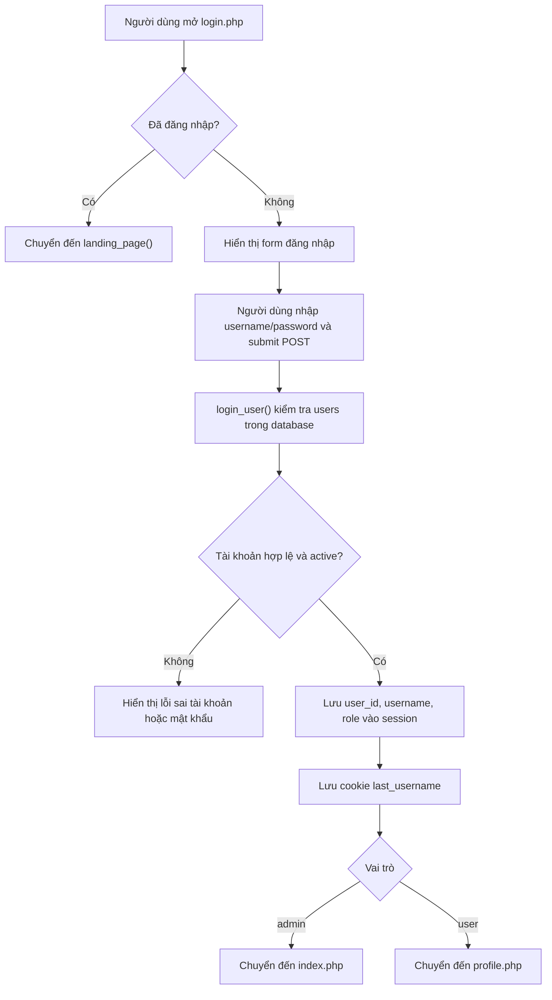
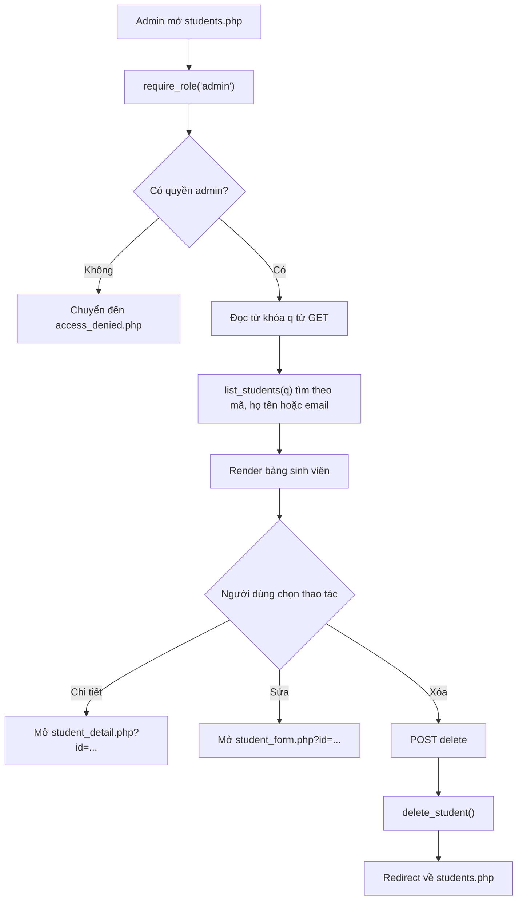
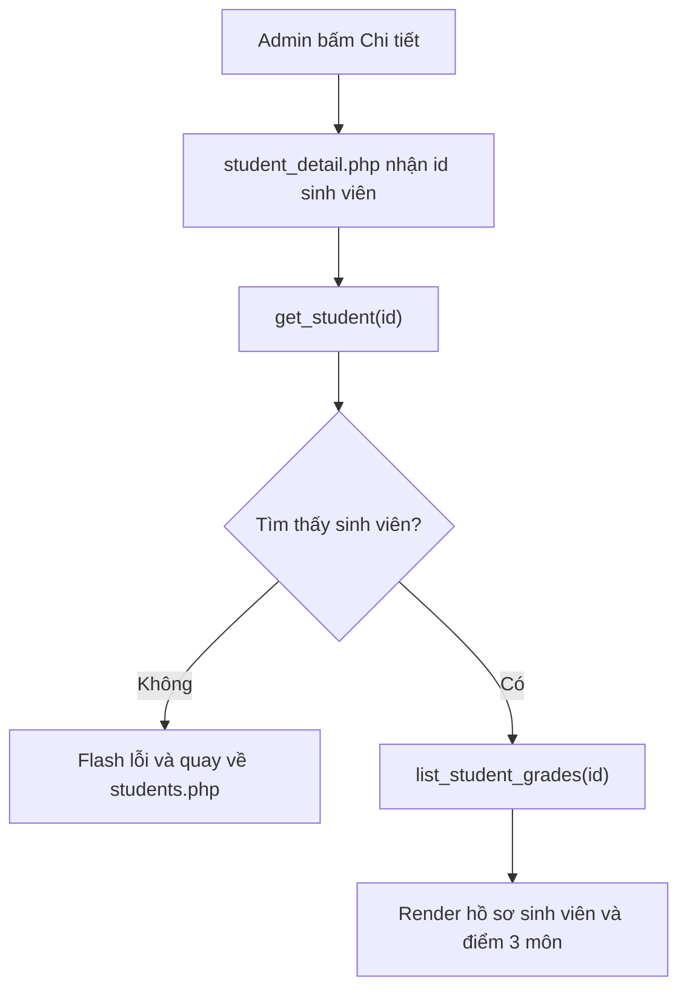
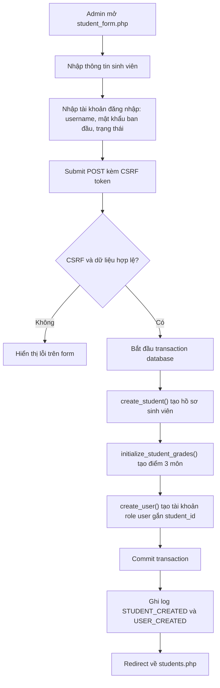
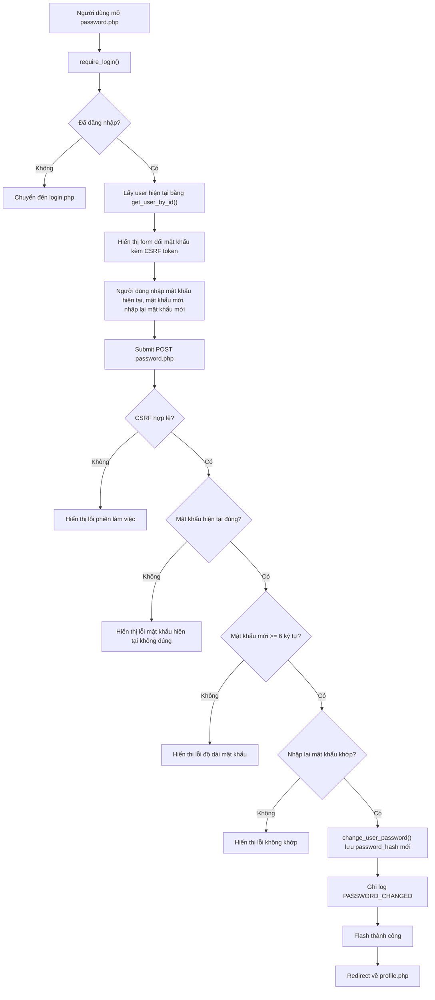

# Workflow chức năng

Tài liệu này mô tả luồng xử lý chính của các chức năng: đăng nhập, xem/thêm sinh viên và đổi mật khẩu.

## 1. Đăng nhập

File chính:

- `public/login.php`: hiển thị form và nhận POST đăng nhập.
- `app/auth.php`: kiểm tra tài khoản, tạo session và phân quyền.
- `app/user.php`: đọc thông tin tài khoản từ database.

Ghi chú:

- Nếu tài khoản đã đăng nhập mà mở lại `login.php`, hệ thống tự chuyển đến trang phù hợp theo quyền.
- Admin vào `index.php`; sinh viên vào `profile.php`.
- Mật khẩu được kiểm tra bằng `password_verify()`, không so sánh mật khẩu dạng plain text.

## 2. Xem sinh viên

File chính:

- `public/students.php`: danh sách, tìm kiếm nhanh và xóa sinh viên.
- `public/student_detail.php`: xem chi tiết sinh viên và điểm 3 môn.
- `app/student.php`: truy vấn, tìm kiếm, thống kê và CRUD sinh viên.
- `app/grade.php`: lấy và cập nhật điểm sinh viên.
- `app/auth.php`: kiểm tra quyền admin.

Luồng xem chi tiết:

Ghi chú:

- Chức năng xem danh sách sinh viên chỉ dành cho admin.
- Sinh viên thường không vào được `students.php`; nếu truy cập trực tiếp sẽ bị chuyển sang `access_denied.php`.
- Danh sách sinh viên đã bỏ lọc ngành/năm và phân trang; chỉ giữ ô tìm kiếm nhanh.
- Khi admin thêm sinh viên mới ở `student_form.php`, hệ thống tạo luôn tài khoản `user` liên kết với sinh viên đó.
- Nếu xóa sinh viên, tài khoản sinh viên liên kết cũng bị xóa để không còn tài khoản không gắn với hồ sơ sinh viên.
- Trang nhật ký ứng dụng chỉ hiển thị 20 dòng log mới nhất sau khi lọc.

Luồng thêm sinh viên kèm tài khoản:

## 3. Đổi mật khẩu

File chính:

- `public/password.php`: hiển thị form và xử lý đổi mật khẩu.
- `app/auth.php`: yêu cầu người dùng phải đăng nhập.
- `app/user.php`: lấy tài khoản và cập nhật password hash.
- `app/logger.php`: ghi log đổi mật khẩu.

Ghi chú:

- Đổi mật khẩu đã được tách khỏi cập nhật hồ sơ.
- `profile.php` chỉ còn cập nhật thông tin cá nhân và xem điểm.
- `password.php` chỉ xử lý mật khẩu, giúp luồng rõ hơn và dễ kiểm tra hơn.
